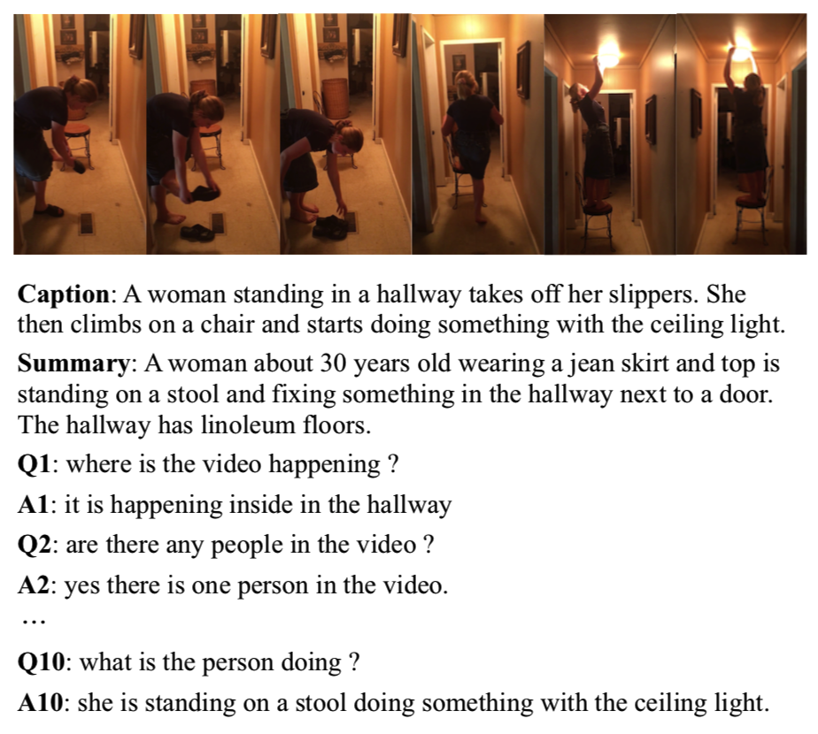
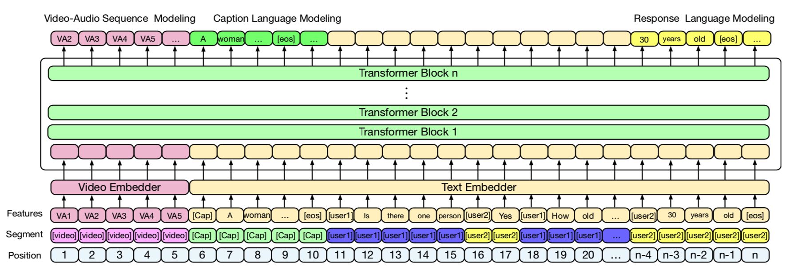

# DSTC8-AVSD
We rank the 1st in DSTC8 Audio-Visual Scene-Aware Dialog competition. This is the source code for our AAAI2020-DSTC8-AVSD paper [Bridging Text and Video: A Universal Multimodal Transformer for Video-Audio Scene-Aware Dialog.](<https://arxiv.org/abs/2002.00163>) Zekang Li, Zongjia Li, Jinchao Zhang, Yang Feng, Cheng Niu, Jie Zhou. AAAI2020.

## News
Our paper is accpeted by IEEE/ACM Transactions on Audio, Speech, and Language Processing (TASLP). [url](<https://ieeexplore.ieee.org/abstract/document/9376902>)

## Abstract

Audio-Visual Scene-Aware Dialog (AVSD) is a task to generate responses when chatting about a given video, which is organized as a track of the 8th Dialog System Technology Challenge (DSTC8). To solve the task, we propose a universal multimodal transformer and introduce the multi-task learning method to learn joint representations among different modalities as well as generate informative and fluent responses. Our method extends the natural language generation pre-trained model to multimodal dialogue generation
task. Our system achieves the best performance in both objective and subjective evaluations in the challenge.



## Model Architecture




## How to Run

### Requirements

Python. 3.6

torch==1.0.1
pytorch-ignite==0.2.1
transformers==2.1.1
tqdm==4.36.1

```shell
pip install -r requirements.txt
```

### Data

Download [dataset](https://drive.google.com/drive/folders/1SlZTySJAk_2tiMG5F8ivxCfOl_OWwd_Q) of the DSTC8, including the training, validation, and test dialogues and the features of Charades videos extracted using VGGish and I3D models.

All the data should be saved into folder `data/` in the repo root folder.

### Train

```shell
python train.py --log_path log/
```

### Generate

```shell
python generate.py --model_checkpoint log/ --output result.json --beam_search
```


## Citation

If you use this code in your research, you can cite our AAAI2020 DSTC8 workshop paper:

```
@article{li2020bridging,
    title={Bridging Text and Video: A Universal Multimodal Transformer for Video-Audio Scene-Aware Dialog},
    author={Zekang Li and Zongjia Li and Jinchao Zhang and Yang Feng and Cheng Niu and Jie Zhou},
    year={2020},
    eprint={2002.00163},
    archivePrefix={arXiv},
    journal={CoRR},
    primaryClass={cs.CL}
}
```


